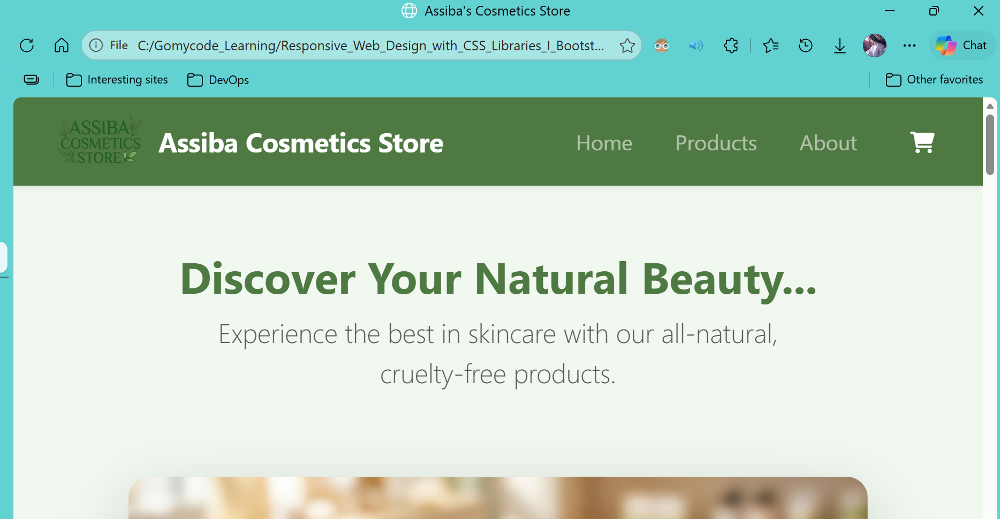
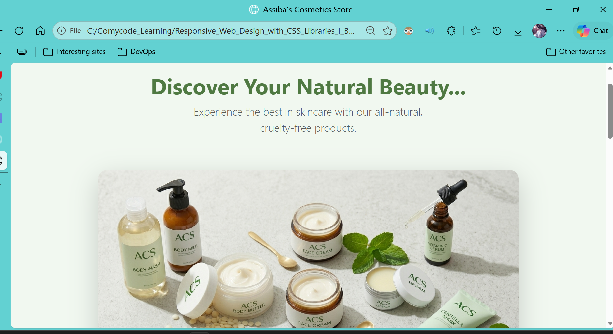
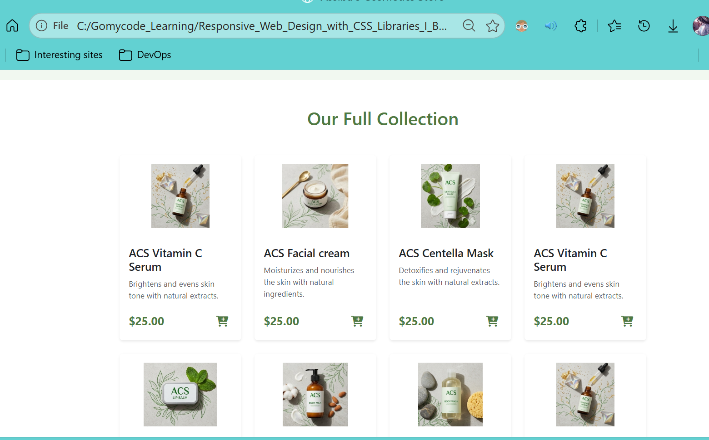
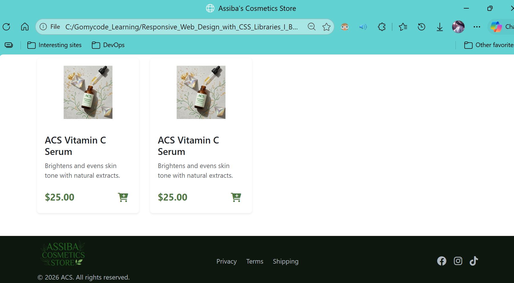
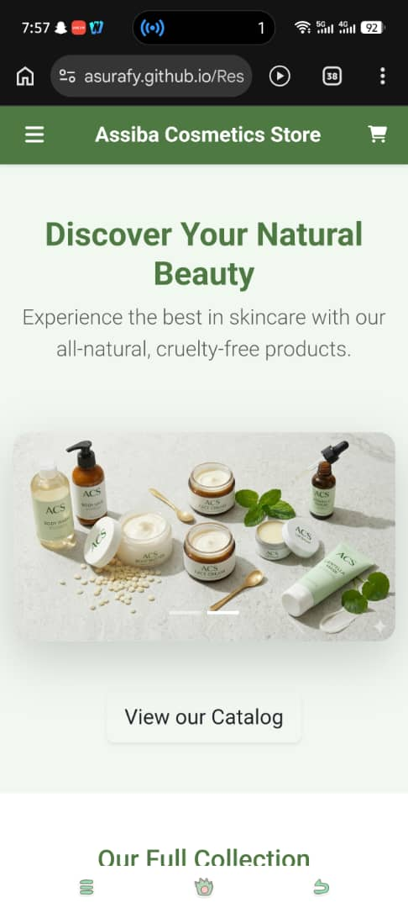
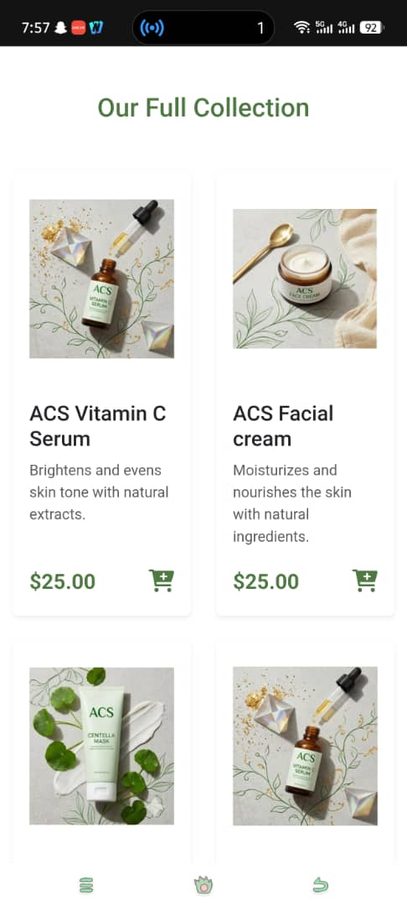
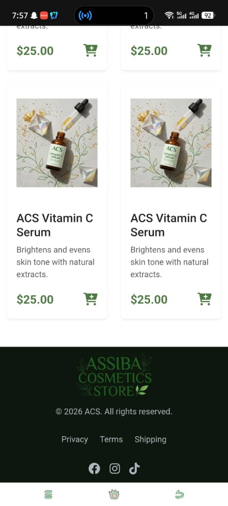

# 🌿 ACS (Assiba Cosmetics Store) : Design Philosophy & Choices

# 1. Visual Identity & Color Strategy
**Monochromatic Harmony**: I utilized a custom CSS variable system (bg-acs-green, bg-acs-light-green) to create a cohesive brand feel. The use of various shades of green evokes a "natural," "organic," and "safe" feeling—crucial for skincare products.

# 2. Layout & Responsive Architecture
**Offcanvas Mobile Navigation**: Instead of a traditional "hamburger dropdown" that pushes content down, I chose the Offcanvas (sidebar) pattern. This mimics modern mobile apps, providing a premium feel and allowing for a clean, focused navigation experience on smaller screens.

**Persistent Shopping Cart**: The shopping cart icon is kept persistent in the top-right corner. This is a critical UX choice for e-commerce, ensuring that the "call to action" (checking out) is always one tap away, regardless of where the user is on the page.

**The 4-2 Grid Logic**: I implemented a responsive grid for the product section:
    --> Desktop: 4 products per row (col-lg-3) for a high-density, "catalog" feel.
    --> Mobile/Tablet: 2 products per row (col-6) to keep product images large and tap-friendly on touch devices.

# 3. Component Design

**The hook** : The heading "*Define your natural beauty...*" serves as the "hook" for the entire website. The choice was based on three main pillars: Empowerment, Curiosity, and Brand Alignment. Using the display-6 and fw-bold classes ensures the text has enough "visual gravity." It is the largest element on the screen, immediately establishing the brand's voice as soon as the page loads.

**Hero Section Slideshow**: I used the carousel-fade class. Fading transitions are perceived as more "luxurious" and "calm" than sliding transitions, which fits the relaxing vibe of a skincare brand.

**Product Card UX**: Each card uses h-100 and flex-column. This ensures that even if one product description is longer than another, all "Add to Cart" buttons and prices align perfectly at the bottom of the row, creating a clean horizontal line.

**Iconography Consistency**: I standardized all UI icons using Font Awesome 6. By choosing "Solid" weights for the bars and cart icons, I ensured the visual "hit area" looks bold and accessible.

# 4. Future-Proofing & Maintenance
**Semantic HTML5**: Using *header, main, and footer tags ensures the site is accessible to screen readers and optimized for SEO (Search Engine Optimization).

**CSS Variable usage**: By centralizing brand colors (like text-acs), the entire brand identity can be changed (e.g., from green to soft pink) by updating just a few lines of CSS.

## 📸 Screenshots

### Desktop View

### Mobile Experience

  

  
  
  

---

## ✨ Features
* **Offcanvas Navigation:** A sleek, app-like sidebar menu for mobile users.
* **Responsive Design:** Fully optimized for Desktop, Tablet, and Mobile using Bootstrap 5.
* **Custom Brand Colors:** Built with a sophisticated `--acs-green` palette.
* **Interactive UI:** Hover effects on product cards and cart icons for better UX.

## 🛠️ Tech Stack
* **HTML5** - Semantic structure.
* **CSS3** - Custom variables and layout refinements.
* **Bootstrap 5** - Responsive grid and components (Offcanvas, Navbar).
* **Font Awesome** - High-quality iconography for the UI.

## ⚙️ Webpage link

   [Click here to visit the website](https://asurafy.github.io/Responsive-Store-Landing-Page-Design/)